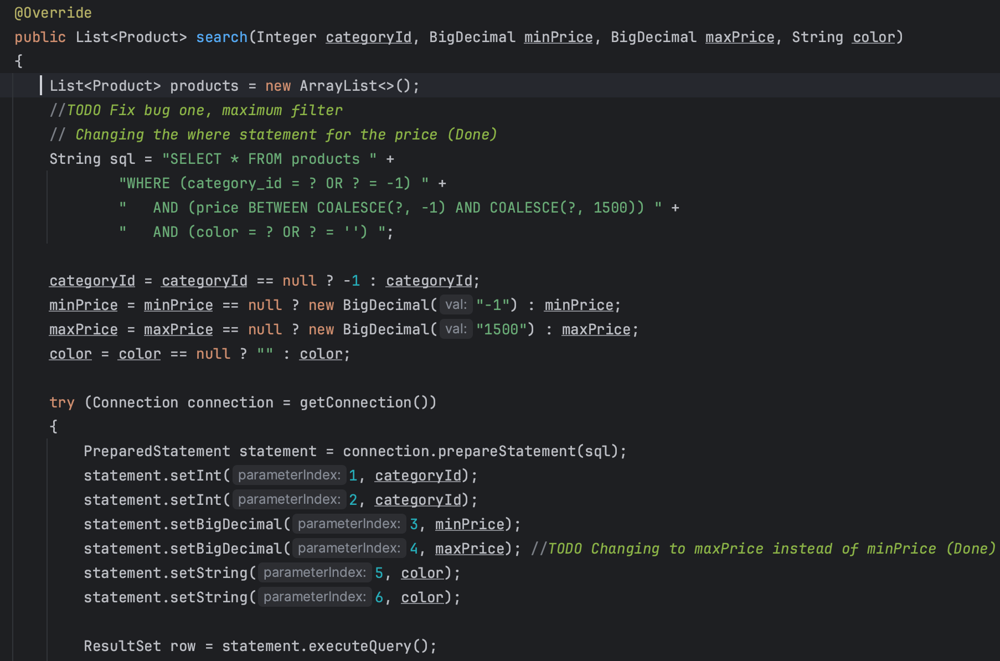

# E-Commerce API

## Searching Products Project

### Search Products by Category, Price Range, and Color

Welcome to the E-Commerce API project! This project serves as the backend for a e-commerce platform, providing a robust set of features for managing categories and products. Built with Spring Boot and Java, the API offers a secure and scalable foundation for e-commerce applications.

Here I added method getById which will get the data from the db,
in this case it will get the category id

Here where I used getById function to get the data using the URL

Here it was BugOne Where I have to change the Where Statement for the Price 

Here it was BugTwo where I have to change the create Function to the update Function. 

