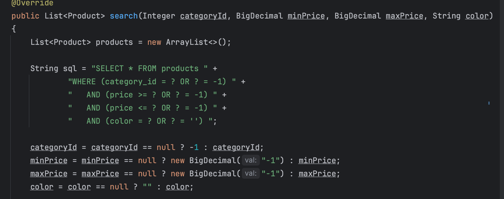
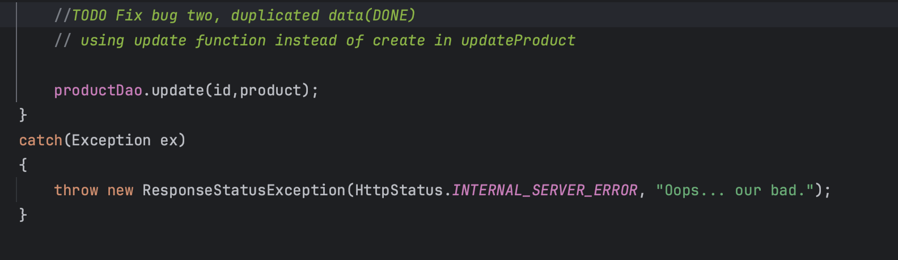

# E-Commerce API

## Searching Products Project

### Search Products by Category, Price Range, and Color

This E-Commerce API is like the engine running behind an online store. It's built using Spring Boot and Java, making it strong and adaptable. Let's dive into it.
First off, you can use it to find products easily. And find specific category, also You can filter products based on their category to help  you quickly locate what you need . If you Looking for something within a certain price range  This API can   set a price range to narrow down your search. And if color matters to you, You can search for products by their color too

Here I added a method getById which will get the data from the db,
in this case it will get the category id

Here where I used getById function to get the data using the URL

Here tt was BugOne Where I have to change the Where Statement for the Price

Here it was BugTwo where I have to change the create Function to the update Function. 

